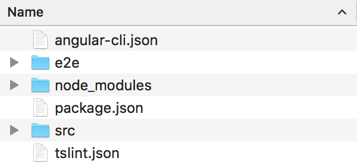
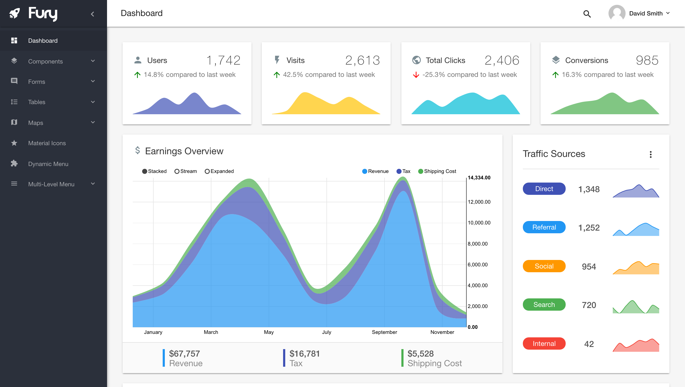

# Fury - Angular 2 Material Design Admin Template
## Introduction

Fury is a creative material design admin template built with Angular 2 and the Angular-CLI. It extends the Material Design components built by the Angular 2 team and it offers you everything you need to get started with your next CRM, CMS or dashboard based project.

Support is available through email, ThemeForest comments or chat. If you purchased the theme and love it, consider giving it a 5-star rating here on ThemeForest. It really helps pushing out more updates and adding more great features.

## Getting Started

In this section you will find the basic folder structure and everything you need to get the theme up and running the first time to start developing.

### Folder Structure

| Name                  | Description |
| -------------:        |---------------
| `angular-cli.json`    | Used for configuration of project specific settings. You can add external styles and scripts, change the output folder, add assets, add environment files and more. | 
| `e2e`                 | Will be used for end-to-end tests to ensure functionality for users before deploying.      |
| `node_modules`        | All external modules used are here. Do not mess with this folder, as it is auto-generated by using `npm install`.      |
| `package.json`        | Contains all dependencies used for production and development. |
| `src`                 | Contains all Angular 2 Typescript code, assets and basically everything the end user will have access to. |
| `tslint.json`         | Angular-CLI includes an automatic Typescript-Linter, which can be configured with this file. |



---

### Using Angular-CLI

Angular-CLI allows you to create a new App in a matter of seconds and provides an awesome way to generate scaffolds for basically all Angular2-Components. [You can take a look at what commands are available here.](//github.com/angular/angular-cli#generating-components-directives-pipes-and-services)

In this article, we are going to install Angular-CLI and it's prerequisites and then generate our first project with a few various components.

---

###Prerequisites
Before we can install Angular-CLI we will have to get a few thing set up first. To run Angular-CLI we will need to install these 2 prerequisites first.

* **NodeJS** v4 or newer  
and
* **Typings** v1 or newer

[A detailed instruction on how to install NodeJS is available here.](//docs.npmjs.com/getting-started/installing-node)

After installing NodeJS there is just one thing left to do: Simply install **Typings** globally by running the command `npm install -g typings` and wait for *npm* to do the dirty work.

If you are on a *UNIX environment, you might have to run the command as administrator. This is done by simply prepending sudo: `sudo npm install -g typings`

---

###Installing Angular-CLI
Installing Angular-CLI is as simple as running this simple command:

`npm install -g angular-cli@latest`  
or
`sudo npm install -g angular-cli@latest`

and the package manager `npm` will do the rest.

---

###Generating the first `Component`
Now that we have installed all prerequisites it's time to start developing our app. Angular-CLI offers a lot of assistance and allows you to generate basically all Angular2-Components there are. *(In a smart way!)*

To generate our first `component` we simply open up a terminal and navigate in our Angular2-App. Now we simply run `ng g component client` and we get a new component in `/src/app/client` with the following files:

* `client.component.ts`
* `client.component.html`
* `client.component.css`
* `client.component.spec.ts`

The files `client.component.ts` and `client.component.spec.ts` contain the most code, the other files only contain placeholders.

**client.component.ts**

```language-typescript
import { Component, OnInit } from '@angular/core';

@Component({
  moduleId: module.id,
  selector: 'app-client',
  templateUrl: 'client.component.html',
  styleUrls: ['client.component.css']
})
export class ClientComponent implements OnInit {

  constructor() { }

  ngOnInit() {
  }

}
```
By executing this short command, we just saved ourselves a lot of time creating all these `Component` files and boilerplate code.

[Syntax for all commands are available here.](//github.com/angular/angular-cli#generating-components-directives-pipes-and-services)

---

###Generating a Service in a specific folder
Now we have our `component`, but what if we want to share some data between components and need to create a `service` to manage this all. Well, we probably would want the service to be in the correct folder, either right in the components folder or in the `shared` folder in `/src/app/`.

Either way, with Angular-CLI we can generate in any folder, wherever we want. Simply use the path *(relative to `/src/app/`)* and use it as the name of the generated component.

`ng g service shared/client`  
or
`ng g service client/shared/client`

Or anything you need.
Afterward we will find two generated files in our specified folder: `client.service.ts` and `client.service.spec.ts`.

**client.service.ts**
```language-typescript
import { Injectable } from '@angular/core';

@Injectable()
export class ClientService {

  constructor() { }

}
```
###Live-Preview and App-Start

Now that we have generated our components, we sure want to see how the result will look like. Luckily Angular-CLI comes pre-configured with a **Live Compile and Reload Server** for which you simply have to run `ng serve` and after a few seconds your site will be live at `http://localhost:4200`.



All changes you now make to your app will automatically be compiled and your open browser window will be reloaded.

These were the first steps with the awesome Angular-CLI and Angular2. Following we are going to get more in detail about developing with Angular-CLI and using the power of Angular2 right.